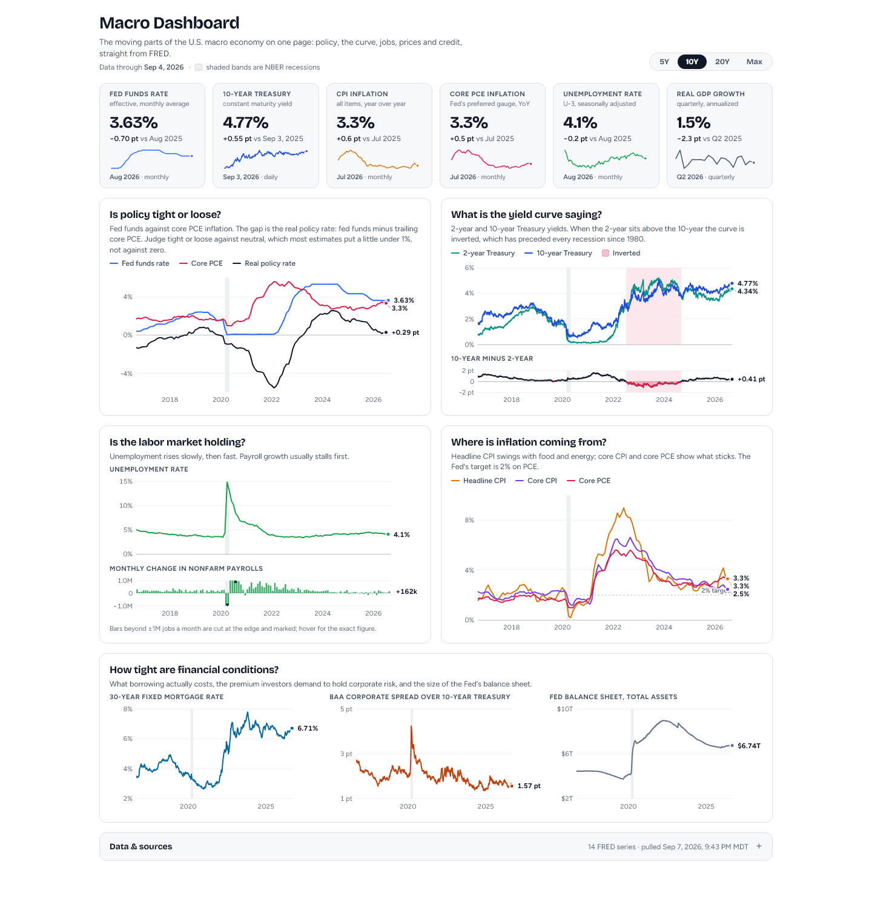

# Macro Dashboard

The moving parts of the U.S. macro economy on one page: six headline numbers, five charts that each answer one question, NBER recession shading on every series, one shared time window, and a table of exactly which FRED series everything came from.



**Headline tiles:** fed funds rate · 10-year Treasury · CPI inflation (YoY) · core PCE inflation (YoY) · unemployment rate · real GDP growth. Each shows the current value, the change from a year earlier, a five-year sparkline, and the date and cadence of the last observation.

**Charts:**

1. **Is policy tight or loose?** Fed funds, core PCE inflation, and the real policy rate (fed funds − trailing core PCE).
2. **What is the yield curve saying?** 2- and 10-year yields, the 10y−2y spread beneath, inversions shaded.
3. **Is the labor market holding?** Unemployment rate over monthly payroll change.
4. **Where is inflation coming from?** Headline CPI, core CPI and core PCE (all YoY) against the 2% target.
5. **How tight are financial conditions?** 30-year mortgage rate, Baa corporate spread over the 10-year, Fed balance sheet.

Hover any chart for exact values and dates (or focus it and use the arrow keys). The 5Y / 10Y / 20Y / Max toggle scopes every chart. The **Data & sources** drawer at the bottom lists every series with its FRED ID, units, cadence, source agency, last observation, how the page uses it, and links to the FRED page, the committed CSV, and the live CSV.

## Run it

```
npm install
npm run dev        # http://localhost:4321
```

`npm run build` writes a static site to `dist/`. `npm test` runs the unit tests for the data transformations.

## Data

Everything comes from [FRED](https://fred.stlouisfed.org) through its public CSV endpoint (`https://fred.stlouisfed.org/graph/fredgraph.csv?id=<SERIES>`). No API key.

```
npm run fred
```

downloads every series to `public/data/fred/<ID>.csv` (untouched, exactly as FRED served it), writes `manifest.json` (name, units, frequency, source, first/last observation, links, fetch time) and `bundle.json` (manifest plus parsed observations, which is what the page loads). The data is committed, so the site is fully static.

**It refreshes itself.** `.github/workflows/fred.yml` runs the script every Monday morning and commits the result; if the repo is connected to Vercel the push redeploys the site. On a fork, enable Actions once under the repo's **Actions** tab. Run it by hand any time from that tab with **Run workflow**, or locally with `npm run fred` and a push.

| Series | Used as | Cadence |
|---|---|---|
| `FEDFUNDS` | Fed funds effective rate | monthly |
| `DGS2`, `DGS10` | 2- and 10-year Treasury yields | daily |
| `T10Y2Y` | 10y − 2y spread | daily |
| `CPIAUCSL`, `CPILFESL` | Headline and core CPI, % change vs a year earlier | monthly |
| `PCEPILFE` | Core PCE, % change vs a year earlier; real rate = fed funds − this | monthly |
| `UNRATE` | Unemployment rate | monthly |
| `PAYEMS` | Payroll change = month-over-month difference | monthly |
| `A191RL1Q225SBEA` | Real GDP growth, quarterly annualized | quarterly |
| `MORTGAGE30US` | 30-year fixed mortgage rate | weekly |
| `BAA10Y` | Baa corporate yield − 10-year Treasury | daily |
| `WALCL` | Fed total assets, shown in trillions | weekly |
| `USREC` | Recession shading | monthly |

Year-over-year rates, the real policy rate and the payroll change are computed on the page from the published levels (`src/components/macro/data.ts`). Nothing else is transformed. Two things worth knowing: CPI inflation is computed from the seasonally adjusted index, so it can differ from the BLS headline (which uses the unadjusted index) by a tenth or so; and BLS never published October 2025, so that month has no year-over-year value.

## Deploy on Vercel

1. Push this repo to your GitHub account (fork it, or create a repo and push).
2. In Vercel, **Add New → Project → Import** the repo. It detects Astro; leave every setting at its default. No environment variables.
3. Deploy. Every push to `main` (including the Monday data refresh) redeploys automatically.

Netlify, Cloudflare Pages and GitHub Pages work the same way: it is a static `dist/` folder.

## Change what it shows

- **Series list:** `SERIES` and `FALLBACK` in `scripts/fetch-fred.mjs`, then `derive()` in `src/components/macro/data.ts` and the `Key` type in `registry.ts`.
- **Colours, names, formats, tile definitions, the "used as" text:** `src/components/macro/registry.ts`.
- **The charts themselves** (which series, panels, captions, reference lines, subtitles): `src/components/macro/MacroDashboard.tsx`.
- **Chart drawing** (axes, bands, bars, end labels, crosshair): `src/components/macro/Panel.tsx`.

## Stack

Astro 5 + React 19 + Tailwind 3. Charts are hand-rolled SVG (about 11 KB gzipped of page JavaScript, no charting library). Fonts are Bricolage Grotesque and Figtree from Google Fonts.

MIT licensed. Built by Teddy Wright.
